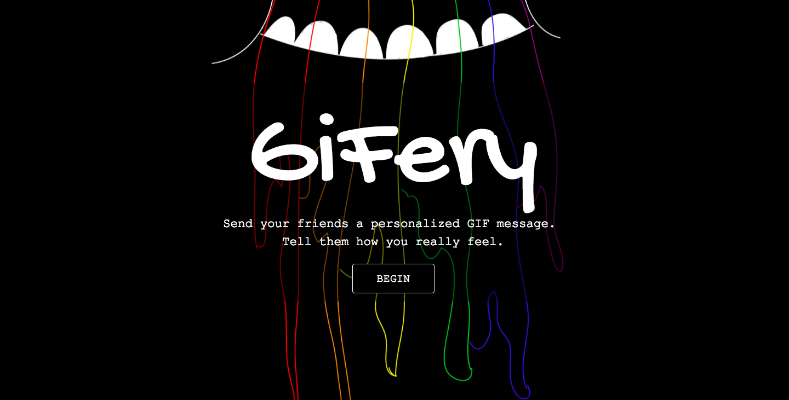

#GiFery
**GiFery** is an application that allows the user to compose an e-card of sorts for their friends.

**Check it out here at:** http://limawebdev1-gifery.surge.sh/

###Features/How-to-use
1. Personalize your "**envelope**" with a to and from.
2. Select a **background color** or **pattern **from an assortment provided to you. My favorite is probably LSP from Adventure Time pattern (see if you can find it).
3. Enter a custom title with your choice in font, size, and color.
4. Search for an array of GIFs by keyword and click on the GIF to include them in your message.
5. Add a personal message!
6. Preview your message and either share via FB or Tweet it to a friend.

***Note**: That last bit isn't fully functional. The FB and Twitter sharing is working, but because only localStorage was used, your friend will not be able to see the card you created. This functionality will be added at a later date.

###Technologies Used
This is a purely front-end app that utilizes **HTML5**, **CSS**, a **Materialize** framework, heavy **jQuery** DOM manipulation and **The Open GIF API** provided by https://github.com/bryanstedman/open-gif-api.
